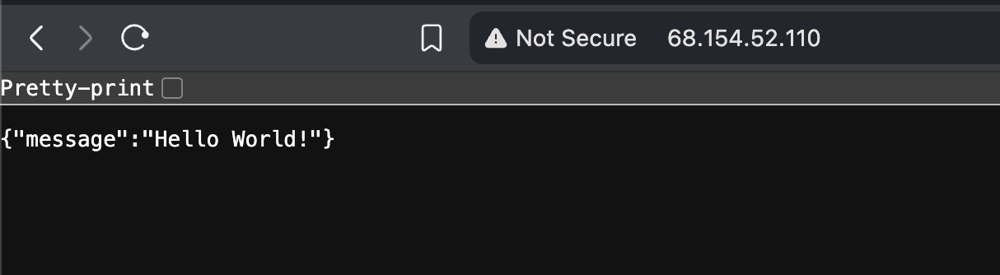

# Proyecto: Hiraoka Clon

### Integrantes del Grupo
- U202115277 James Caleb Delgado Perez
- U202421876 Gustavo Antonio Perez Rojas
- U20221C464 Jose Alberto Quispe Zavaleta


## Configuracion de Credenciales
1. Crea un archivo `.env` dentro de la VM 

2. Ejecuta los siguientes comandos
```sh
chmod +x scripts/export_env.sh 
source ./scripts/export_env.sh
```

## Configuracion con NGINX dentro de la VM
1. Ejecutar el proyecto usando
```sh
uvicorn main:app --host 0.0.0.0 --port 8000
```

2. Consultar si el puerto esta ejecutandose en otra terminal pero dentro de la VM
```sh
curl http://localhost:8000
```

3. Crear un archivo de configuración para la aplicación
```
sudo nano /etc/nginx/sites-available/fastapi-app
```

4. Agregar esta configuración dentro:
```sh
server {
    listen 80;
    server_name <ip publica de la vm>;
    
    location / {
        proxy_pass http://0.0.0.0:8000;  # Puerto donde corre FastAPI
        proxy_set_header Host $host;
        proxy_set_header X-Real-IP $remote_addr;
        proxy_set_header X-Forwarded-For $proxy_add_x_forwarded_for;
        proxy_set_header X-Forwarded-Proto $scheme;
    }
}
```

5. Habilitar la configuracion
```sh
# Crear enlace simbólico
sudo ln -s /etc/nginx/sites-available/fastapi-app /etc/nginx/sites-enabled/

# Opcional: deshabilitar la configuración por defecto
sudo rm /etc/nginx/sites-enabled/default

# Verificar la configuración
sudo nginx -t

# Reiniciar NGINX
sudo systemctl restart nginx
```

6. Verificar que el puerto 8000 esté abierto localmente
```sh
sudo netstat -tlnp | grep :8000
```

7. Ejecutar la ip publica de la VM en una pestaña nueva en el navegador
Se tendria que ver algo así
